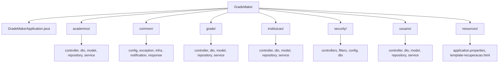

### Estrutura de pastas



# GradeMaker 

---

## 🐳 Funcionamento do Docker no Projeto

A aplicação utiliza o Docker para facilitar o ambiente de desenvolvimento e execução. São definidos dois serviços principais no `docker-compose.yml`:

* **`app`**: Responsável por construir e rodar a aplicação Spring Boot.
* **`db`**: Um container PostgreSQL 15 configurado com persistência de dados e um script de inicialização.

### 📜 Script de Inicialização do Banco

O banco é populado com o arquivo `init.sql`, localizado na pasta `init/`. Este script:

* Cria as tabelas necessárias;
* Insere os dados iniciais (perfis, instituições, turnos, etc.).

> ⚠️ **Atenção:** Se houver alterações no banco contidas no documentatation/DataBase **essas alterações devem estar sincronizadas com o `init/init.sql`**, pois **apenas esse arquivo será executado automaticamente** durante a criação inicial do container do banco.

> 🧹 Para reexecutar o script e limpar os dados existentes, use:
>
> ```bash
> docker-compose down -v
> ```

---

## Como Iniciar o Projeto com Docker

1. Certifique-se de que o Docker e o Docker Compose estão instalados.
2. No terminal, navegue até a raiz do projeto e execute:

```bash
docker-compose up --build
```

3. Acesse a aplicação em:

```bash
http://localhost:8080/api
```

---

## ✅ Testando a API

### Criar Usuário via `curl`

```bash
curl -X POST http://localhost:8080/api/public/usuarios \
  -H "Content-Type: application/json" \
  -d '{"nome":"Maria","email":"maria@email.com","senha":"123456"}'
```

### Conceder Acesso ao Usuário via `curl`

```bash
curl -X POST http://localhost:8080/api/public/dar-acesso \
  -H "Content-Type: application/json" \
  -d '{"usuarioEmail": "weslleywilker2@gmail.com", "perfilId": 1, "instituicaoId": 1}'
```
>Sem esses comandos o usuário não conseguirá fazer o login. é preciso cadastralo e atribuir um perfil a ele.
---

## 🔍 Acessando o Banco de Dados

Conecte-se ao container do banco com:

```bash
docker exec -it postgres_db psql -U postgres -d grade_maker
```

Listar tabelas:

```sql
\dt
```

---

Caso vejam algum passo para inicialização que eu nem tenha previsto, atualizem o readme.
Ele será o novo manual de instruções.

